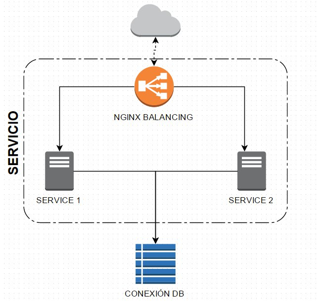

Se vera a continuación una guía del como poder crear nuestro propio contenedor, y con el que levantaremos el servicio de balanceo de carga. El cual permite distribuir las conexiones entre servidores activos.

Construir un contenedor
-----------------------

Para esto debemos de crear nuestro propio documento [Dockerfile](http://docs.docker.com/reference/builder/), para caso de este ejercicio se puede ver el Dockerfile que esta dentro del directorio `nginx/`.

Una ves se tenga prepara do se ejecutar el siguiente comando.

> ***NOTA:*** Para ejecutar este comando se debe de estar en el directorio en donde se encuentre el documento `Dockerfile`.

```bash
$ docker build -t ownnginx .
```


Preparando app1
---------------

Se debe de estar dentro del directorio `app1/` para este comando.

```bash
$ docker build -t ownapp1 .
```


Preparando app2
---------------

Se debe de estar dentro del directorio `app2/` para este comando.

```bash
$ docker build -t ownapp2 .
```


Arquitectura de sistema
-----------------------

Ya teniendo listo estos dos contenedores podemos ejecutar la siguiente arquitectura.



En el cual usamos a [nginx](http://nginx.org) para redistribuir la carga de la aplicación. Permitiendo que de forma automática el servidor escoja entre uno u otro servidor.

> ***MAS INFORMACION:*** Ver en [nginx.org load_balancing](http://nginx.org/en/docs/http/load_balancing.html).


Ejecutamos la app1
------------------

```bash
$ docker run -d --name app1 ownapp1
```


Ejecutamos la app2
------------------

```bash
$ docker run -d --name app2 ownapp2
```


Finalmente ejecutamos NGINX
---------------------------

El cual generamos un link (con el parámetro [`--link`](https://docs.docker.com/userguide/dockerlinks)) para que nginx puede ver las app, app1 y app2.

```bash
$ docker run -d --name nginx --link app1:srv1 --link app2:srv2 -p 80:80 ownnginx
```
